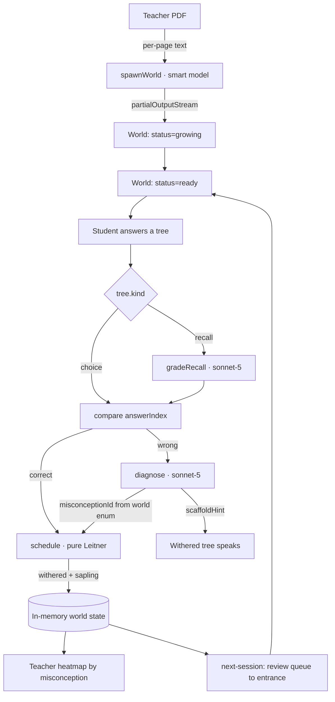

# BUILDER B — THE BRAIN

**You own the PDF pipeline and every AI call.** This is the segment most likely
to surprise you, so you start here and you start immediately.

**Read `docs/CONTRACT.md` first.** You export **six** functions and nothing else.
C calls them; A never does.

---

## Your stack

```bash
npm i ai@7.0.99 @ai-sdk/anthropic@4.0.53 zod@4.6.2
```

`ANTHROPIC_API_KEY` in `server/.env`. Never commit it.

**The structured-output API has moved.** `generateObject` is not the documented
path any more — it is `generateText` / `streamText` with `Output.object`.
Verified against current AI SDK docs. Do not copy patterns from older projects.

---

## Your files

```
server/brain/
  index.ts         the 6 exports, nothing else public
  spawn.ts         PDF -> World
  diagnose.ts      wrong answer -> misconception + scaffold
  grade.ts         recall-tree text grading
  schedule.ts      Leitner. pure, synchronous, unit-tested
  schemas.ts       zod schemas shared with C
  prompts.ts       the system prompts
  __tests__/
    schedule.test.ts    real unit tests, TDD
    fixtures/           captured LLM responses for deterministic tests
```

Your public surface, exactly as in the CONTRACT:

```ts
spawnWorld(input: SpawnInput, syllabus: Syllabus, onPartial: (w: Partial<World>) => void): Promise<World>
diagnose(tree: Tree, response: string|number, world: World): Promise<Diagnosis>
gradeRecall(tree: Tree, text: string): Promise<{ correct: boolean; why: string }>
gradeExplanation(tree: Tree, text: string): Promise<Explanation>   // teach trees, 4:30
focusQuest(world: World, misconceptionId: string): Promise<Tree[]>  // Deploy Quest, hour 5
schedule(world: World, treeId: string, correct: boolean): World
```

You also own **`server/brain/syllabus.json`** — a small hand-written file of MOE
Singapore Mathematics topics for Primary 3 through Primary 6. It feeds C's three
dropdowns and anchors your spawn prompt. Ten minutes of typing, no cleverness
required. One system, one subject. Do not generalise it.

---

## 0. Four ingestion paths, one pipeline

`spawnWorld` branches only on how it builds the message content. Everything after
that — schema, streaming, layout, diagnosis — is identical. Keep the branch to
about six lines; do not fork the pipeline.

| `source.kind` | Message content | Provenance | Build it? |
|---|---|---|---|
| `pdf` | per-page text via `unpdf`, sent as `<page n>` blocks | page + quote, **server-verified** | **Core.** The hero path. |
| `text` | the pasted text in the text part | none (`citation: null`) | **Yes** — same code as `prompt` |
| `prompt` | topic description only, no document | none | **Yes** — ~zero cost |
| `url` | `web_fetch` server tool | page + quote | **Hour-5 stretch only** |

`text` and `prompt` are effectively free, and they make the product demo as a
platform rather than a PDF converter. Build them.

### The URL path — read this before you promise it to anyone

**A Khan Academy link does not work.** Two independent blockers, both checked:

1. Khan Academy sits behind an active bot challenge — even `robots.txt` returns a
   JavaScript interstitial, and a lesson page returns a ~3 KB shell with no
   content in it.
2. Claude's `web_fetch` tool does not support JavaScript-rendered sites. The docs
   say so explicitly. Khan Academy is a React SPA.

Getting around that needs a headless browser, which is a 90-minute sink and a
terms-of-service problem. **Do not build it, and do not say "paste a Khan
Academy link" on stage.**

**Tested and working** (plain fetch returns real content, so `web_fetch`'s
no-JavaScript constraint is satisfied):

| Source | Result |
|---|---|
| **Project Gutenberg** `/cache/epub/<id>/pg<id>.txt` | ✅ plain text, public domain — **use this for the reading world** |
| Simple Wikipedia | ✅ ~154 KB of real content, primary reading level |
| Wikipedia / Wikibooks | ✅ |
| OpenStax | ✅ |
| CK-12 | ❌ 403 |
| BBC Bitesize, Khan Academy | ❌ blocked / JS-rendered |

Any **public PDF URL** also works without `web_fetch` at all — pass a document
block with a URL source instead of a file buffer. That covers syllabus PDFs,
past papers and worksheets hosted on school sites.

**Never ingest the sponsor's library.** Epic's 40K books are licensed content;
do not fetch, scrape or reproduce them, and do not imply a partnership. Public
domain texts give the identical demo with none of that exposure.

What the URL path *can* do beyond that is server-rendered pages, via the
server-side tool:

```ts
tools: [{
  type: 'web_fetch_20250910',
  name: 'web_fetch',
  max_uses: 3,
  allowed_domains: ['...'],        // curate an allowlist; never leave it open
  // no `citations` here: the citations API + structured output = HTTP 400
  max_content_tokens: 100000,
}]
```

If you build it, **test your demo URL first** and keep the allowlist tight. If
any third-party content ever ships for real, its licence needs checking — not a
hackathon problem, but don't claim otherwise in the pitch.

---

## 1. `spawnWorld` — the PDF is the hero path. This call is the whole feature.

One call does everything: reads the PDF, writes the questions, tags Bloom
levels, derives the prerequisite graph, and predicts the misconceptions.
**No pdf.js.** Claude takes the PDF directly.

### Verified constraints

- Max request **32 MB**, max **600 pages** (drops to **100** if the context
  window is under 1M tokens). A worksheet is fine.
- PDFs must be standard — **no passwords, no encryption**. A teacher *will*
  upload an encrypted one. Return a clean error, don't crash.
- **Scanned PDFs do not work.** Text extraction only reads a PDF's text layer, so
  an image-only worksheet extracts to almost nothing. If extraction returns under
  ~200 characters, fail with a clear message — *"This PDF looks scanned. Paste the
  text, or pick a topic instead."* — never spawn an empty world.

### The call

```ts
import { anthropic } from '@ai-sdk/anthropic';
import { streamText, Output } from 'ai';

const result = streamText({
  model: anthropic('claude-opus-5'),
  output: Output.object({ schema: WorldSpawnSchema }),
  messages: [{
    role: 'user',
    content: [
      { type: 'text', text: SPAWN_PROMPT(syllabus) },
      { type: 'text', text: pagesToText(await pdfToPages(input.data)) },  // <page n> blocks
    ],
  }],
  providerOptions: { anthropic: { structuredOutputMode: 'auto' } },
});

for await (const partial of result.partialOutputStream) {
  onPartial(partial);          // trees appear in the world as they generate
}
const world = await result.output;
```

Notes that will cost you time if you miss them:
- `mediaType`, **not** `mimeType`. `mimeType` is the stale spelling in older docs.
- `streamText` + `partialOutputStream` is why the forest visibly grows instead of
  the teacher staring at a spinner for 60 seconds. Worth the 15 minutes.
- `await result.output` rejects with `TypeValidationError` if the final object
  fails the schema. Catch it and fall back (see below).

### Citations — the model writes them, the server verifies them

**Correction to an earlier version of this brief:** it said to turn on Claude's
citations API alongside `Output.object`. That returns **HTTP 400** — Anthropic's
docs state citations *"are incompatible with structured outputs."* Zen caught
this. Thank you, Zen.

So `{ page, quote }` is filled **by the model, inside the schema**, reading the
`<page n>` blocks. That means a quote *could* be invented — and "hover to see the
teacher's own text" is our answer to "did the AI make this up?", so it has to be
true. Verify every citation against the extracted text before the world ships:

```ts
const norm = (s: string) => s.toLowerCase().replace(/\s+/g, ' ').trim();

function verifyCitations(world: World, pages: string[]): World {
  return { ...world, trees: world.trees.map(t => {
    const c = t.citation;
    const page = c && pages[c.page - 1];
    const ok = !!page && norm(page).includes(norm(c.quote));
    if (c && !ok) console.warn(`[brain] dropped unverifiable citation on ${t.id}`);
    return ok ? t : { ...t, citation: null };
  })};
}
```

A dropped citation just hides the `📄` chip for that tree — nothing breaks. Log
the drop rate during rehearsal; if it's high, tighten the prompt ("quote verbatim,
no paraphrase") rather than loosening the check.

**Prompt caching** is still worth wiring on the Anthropic path — you'll re-spawn
the demo worksheet dozens of times. Skip it if it fights you for over 15 minutes.

### `SPAWN_PROMPT` must ask for all five things

The prompt is **anchored to the syllabus** the teacher picked — pass
`system`, `level`, `subject`, `topic` in the text part, and tell the model to map
every concept it finds to a named syllabus outcome in `syllabusRef`. The PDF
supplies the content; the syllabus supplies the vocabulary. That is what makes
the teacher heatmap read in the teacher's own language instead of the model's.

1. **concepts** — 3–5 per worksheet. Any more and the forest is too big to walk.
   Each carries `syllabusRef` and `level`.
2. **prerequisites** per concept — concept ids only. *This is the world model.*
   It's what locks groves behind mastery. Tell the model to produce a DAG and to
   leave the entry concept's prerequisites empty.
   **Plus one concept from the level above** (`level: 'Primary 6'` in a Primary 5
   world), prerequisite on every other concept. That is the level ladder — the
   deepest, locked grove that fires LEVEL UP when cleared. Ask for it explicitly
   or the model won't produce it.
3. **trees** — 5–8 questions per concept, each tagged with its concept, with
   `kind: 'choice'` (4 options) or `kind: 'recall'` (~25%, free text answer).
4. **Bloom level** per concept: `remember` | `understand` | `apply`.
5. **misconceptions** — 6–10 across the worksheet. Specific and diagnostic
   ("compares fractions by numerator alone, so thinks 5/8 > 3/4"), never vague
   ("struggles with fractions").
   These become the enum `diagnose` classifies into, and the labels the teacher
   sees on the heatmap. **If these are weak, the whole product is weak.**
6. **`questName`** per concept — a short, concrete place name that fits the
   concept: *The Fraction Bridge*, *The Numerator Falls*, *The Context Clue
   Crossing*. It titles the quest, labels the bridge and appears in every toast,
   so it is the most-seen string in the game. Ask for it in the same call;
   it costs nothing extra. No puns that obscure what the concept is.

Also require, in the prompt: questions must be answerable from the document
alone; every question carries the page it came from; no question restates
another; explanations explain the *reasoning*, not just the answer.

### Hard requirement: the cached fallback world

**Commit a real, pre-generated `fallbackWorld.json`** from the actual demo
worksheet, and make the server serve it if spawn fails or exceeds 90 seconds.
Do this at hour 3, not hour 6. If the API rate-limits you on stage, the demo
still runs and nobody in the room can tell.

---

## 2. `diagnose` — the part that makes this a tutor, not a quiz

Runs on every wrong answer. `claude-sonnet-5`, `effort: 'low'` — it's in the hot
path and the student is waiting.

```ts
const { output } = await generateText({
  model: anthropic('claude-sonnet-5'),
  instructions: DIAGNOSE_PROMPT,
  prompt: `Concept: ${concept.name}
Question: ${tree.question}
Correct answer: ${correctAnswer}
Student answered: ${studentAnswer}`,
  output: Output.object({
    schema: z.object({
      misconceptionId: z.enum(worldMisconceptionIds),   // fixed enum, per world
      confidence: z.number().min(0).max(1),
      scaffoldHint: z.string(),
      evidence: z.string(),
    }),
  }),
  providerOptions: { anthropic: { effort: 'low' } },
});
```

**The `z.enum` is the entire trick.** The model cannot invent a misconception —
it must classify into that world's taxonomy. That's what makes the result a
*measurement* C can aggregate across students, instead of prose a teacher has to
read one at a time. Free-text diagnosis would kill the heatmap.

`scaffoldHint` rules, put them in the prompt in these words:
- It is **a question, never an answer.** "What would 3/4 look like written in
  eighths?"
- It never restates the correct option.
- One sentence. It appears as the withered tree speaking to the student.
- If the student asks to just be told, it refuses warmly and asks again.

Build a `confidence < 0.5` path: emit `misconceptionId: 'unclassified'` rather
than forcing a bad label into the teacher's heatmap. A wrong diagnosis on the
dashboard is worse than an honest gap.

---

## 2b. `gradeExplanation` — the teach tree. Build this at 4:30, not before.

```ts
gradeExplanation(tree: Tree, text: string): Promise<{
  passed: boolean; hit: string[]; missing: string[]; encouragement: string;
}>
```

Same call shape as `gradeRecall`, different rubric: score the student's
explanation against `tree.rubric[]` and return which points they hit and which
they missed. Generous on wording, strict on substance — a child explaining
something correctly in clumsy words has understood it.

`encouragement` is one sentence **in the voice of Mia, the classmate the student
just helped** — "Oh! So you make the bottoms the same first. Thanks!" Name what
they got right. Never a grade, never a percentage. Teach trees are now a social
interaction in the world, so the grader's output is dialogue.

This is the protégé effect: explaining a concept to someone else produces better
retention than reviewing it. Real citations for the slide — **Fiorella & Mayer**
on learning by teaching, **Chi et al.** on self-explanation, and **Dunlosky et
al. (2013)** for which techniques actually carry high utility.

**Do not cite the Learning Pyramid** (the 90/75/50/30/20/10/5 figures). Those
numbers have no traceable empirical source and the pyramid is widely criticised.
At an event that asks for citations, using it is a risk that costs more than it
gains. The mechanic is well supported; that particular chart is not.

## 2c. `focusQuest` — the teacher's Deploy button. Hour 5.

```ts
focusQuest(world: World, misconceptionId: string): Promise<Tree[]>   // 5 trees
```

`claude-opus-5` — it runs once per click and wants the quality. Generate **five
trees targeting only that one misconception**, rising in difficulty, mixing
`choice` and one `teach`. Same schema, same `Output.object`, so C drops them
straight into the world and A renders them with no new code.

This is the beat that closes the circuit: student game → AI diagnosis → teacher
intervention → student mastery. Nothing else in the build connects all four.

## 2d. Confidence calibration — nearly free, real Track 3 credit

`/api/answer` carries `confidence: 'low' | 'medium' | 'high'` from the fox. You
do not need a model call for this — it is a comparison:

| Confidence | Correct? | `calibration` |
|---|---|---|
| high | wrong | `overconfident` |
| low | right | `underconfident` |
| anything else | — | `calibrated` |

Feed it into the scaffold prompt: an overconfident student needs "are you sure?
check X" before a hint; an underconfident one needs "you were right — trust
that." **Metacognitive monitoring**, which is exactly what Track 3 names, for
about ten lines of code.

## 3. `gradeRecall`

Free-text answer → `{ correct, why }`. `claude-sonnet-5`, `effort: 'low'`,
boolean-plus-reason schema. Accept correct answers phrased differently, accept
missing units if the number is right, reject the right word with wrong reasoning.
Put those three rules in the prompt explicitly.

---

## 4. `schedule` — pure, synchronous, and the one thing you actually TDD

No API calls. Deterministic. Write the tests first — red, green, refactor.

```ts
schedule(world: World, treeId: string, correct: boolean): World
```

Leitner, 3 boxes: correct → `box + 1` (cap 3); wrong → back to box 1.
Then apply the wither/sapling rules exactly as written in the CONTRACT —
identical semantics to what A renders, or the visuals desync from the state.

Tests to write before the implementation:
- correct on a healthy box-1 tree → box 2, stays `healthy`, no sapling
- wrong on a healthy tree → `withered`, box 1, sapling spawned, `spawnedFrom` set
- correct on a sapling → parent `regrown`, sapling `healthy`
- wrong on a sapling → second sapling; a third wrong spawns **no** third sapling
- box 3 is retired: no respawn even on a wrong answer in a later session
- `conceptHealth` = (healthy + regrown) / total, per concept
- `nextSession()` → box 1 + box 2 back to `healthy`, saplings cleared,
  `sessionIndex` incremented

## Deterministic mock mode — build this before you spend real tokens

Capture 3–4 real LLM responses into `__tests__/fixtures/` and add a
`BRAIN_MOCK=1` env flag that replays them instead of calling the API. You get:
fast tests, no burned tokens during integration, and a working system when the
wifi dies. C can develop against `BRAIN_MOCK=1` all afternoon.

---

## Agent architecture



**State lives in exactly one place** — C's in-memory store, shaped as `World`.
Your functions are stateless: they take a `World` and return a `World` or a
`Diagnosis`. No module-level mutable state in `server/brain/`. That's what makes
`schedule` testable and the integration boring.

---

## Checkpoints

| Time | Must be true |
|---|---|
| 0:30 | Brain package scaffolded, key in `.env`, `schemas.ts` matches CONTRACT |
| 1:00 | **One real PDF → valid world JSON printed to console.** Nothing else matters until this works. |
| 1:30 | **Verified** citations + Bloom + prerequisites + misconceptions all populating |
| 2:00 | `schedule` tests green; `BRAIN_MOCK=1` replays fixtures |
| **2:30** | **Handoff: C can call `spawnWorld` and get a real world** |
| 3:00 | `diagnose` returning sane misconception + scaffold on real wrong answers |
| 3:30 | `gradeRecall` working on recall trees |
| 4:00 | **`fallbackWorld.json` committed** |
| 5:00 | Prompts tuned — spend this hour on misconception quality, it's the product |

---

## Do not touch

`client/**` and `server/index.ts`. You expose six functions. If you're editing
an express route, you're doing C's job.
